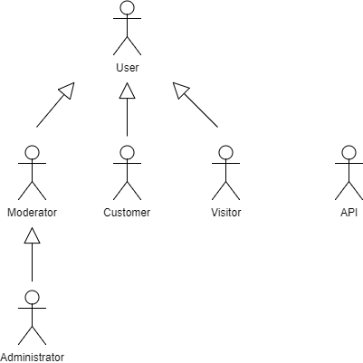

# A2: Actors and User stories
This artifact contains the specification of the actors and their users stories, serving as agile documentation of project requirements.

## 1. Actors
 
For the Sonic Flow system, the actors are represented in Figure 1 and described in Table 1.

Figure 1: Actors.

Table identifying actors, including a brief description and examples.

| Identifier |Description |Example|
|:----------:|------------|:-----:|
| User|Generic user. Has access to public information, such as product information and system configurator.|n/a|
| Visitor |Unauthenticated user. Can register or authenticate itself in the system. Can also add products to the shopping cart.|n/a|
| Customer	|Authenticated user. Can buy and manage a list of favorite products as well as rate and comment them. A customer can also follow his active shipments.|jlopes|
| Moderator	|Authenticated user with privileges to moderate products comments.|xfontes|
| Administrator	|Administrative account. Can manage the product listings.|edumix|

Table 1: Actor's description.

 
## 2. User Stories
 
For the Sonic Flow system, consider the user stories that are presented in the following sections.

### 2.1. User
|Identifier	|Name	|Priority	|Description|
|:---------:|-----|:-------:|-----------|
|US01|Search|high|As an User, I want to consult all the public information.|
|US02|Home page|high|	As an User, I want to access home page, so that I can see featured products.|
|US03|About page|high|	As an User, I want to access about page, so that I can see a complete website's description.|
|US04|Contact page|high|	As an User, I want to access contact page, so that I can see every contact.|
|US05|Shopping cart|high|	As an User, I want to add items to a shopping cart.|
|US06|Comparison|	medium	|As an User, I want to compare similar products.|
|US07|FAQ page|medium|	As an User, I want to access FAQ page, so that I can see FAQ's.|
|US08|Configurator|medium|	As an User, I want to access the system configurator.|

Table 2: User's user stories.

### 2.2. Visitor
|Identifier	|Name	|Priority	|Description|
|:---------:|-----|:-------:|-----------|
|US11|Log in	|high|	As a Visitor, I want to authenticate into the system, so that I can access privileged information.|
|US12|Register |high|	As a Visitor, I want to register myself into the system, so that I can authenticate myself into the system.|
|US13|Register using external API|low|	As a Visitor, I want to use register a new account linked to my Google account, so that I can access privileged information.|
|US14|Log in using external API|low|	As a Visitor, I want to log in through my Google account, so that I can authenticate myself into the system.|

Table 3: Visitor's user stories.

### 2.3. Customer
|Identifier	|Name	|Priority	|Description|
|:---------:|-----|:-------:|-----------|
|US21|Buy|high|	As a Customer, I want to buy products.|
|US22|Favorites add|high|	As a Customer, I want to add an item to my favorites.|
|US23|Favorites remove|high|	As a Customer, I want to remove an item from my favorites.|
|US24|Comment|high|	As a Customer, I want to register a comment, so that I can manifest my opinion about a product.|
|US25|Rate|high|	As a Customer, I want to rate a product so that I can classify it.|
|US26|Profile|high|As a Customer, I want to change my information, so that I can keep it updated (e.g. password,address,profile picture).|
|US27|Account Delete|high|	As a Customer, I want to be able to delete my account.|
|US28|Purchase History|medium|	As a Customer, I want to access my purchase history.|
|US29|Newsletter|medium|	As a Customer, I want to enable or disable newsletter.|
|US210|Availability|low| As a Custumer, I want to be able to be notified when a product is available.|

Table 4: Customer's user stories.

### 2.4. Moderator
|Identifier	|Name	|Priority	|Description|
|:---------:|-----|:-------:|-----------|
|US31|Remove comments|high|	As a Moderator, I want to remove a comment, so that I remove inappropriate content.|
|US32|Add offense|medium|	As a Moderator, I want to record the number of offenses commited by a system user, so that he can no longer register comments.|
|US33|Ban user|medium|	As a Moderator, I want to be able to ban a user when he commited too many offenses.|

Table 5: Moderator's user stories.

### 2.5. Administrator
|Identifier	|Name	|Priority	|Description|
|:---------:|-----|:-------:|-----------|
|US41|Add Products|high|As an Administrator, I want to add products.|
|US42|Remove Product|high|As an Administrator, I want to remove a product.|
|US43|Modify Product|high|As an Administrator, I want to change a product's attributes.|

Table 6: Administrator's user stories.

## A1. Annex: Supplementary requirements
 
This annex contains business rules, technical requirements and other restrictions on the project
 
### A1.1. Business rules

A business rule defines or constrains one aspect of the business, with the intention of asserting business structure or influencing business behaviour.

|Identifier	|Name	|Description|
|:---------:|-----|-----------|
|BR01|Consistency|A customer can only comment on a product he has previously bought.|
|BR02|Stock Management|A product can only be bought if it is available.|
|BR03|Loyalty Points|For each euro spent, the customer gains 1 loyalty point(LP).|
|BR04|Loyalty Discounts|1000 LP can be used as a 10% discount on a single purchase. This purchase will not add LP.|

Table 7: Business Rules
 
### A1.2. Technical requirements

Technical requirements are concerned with the technical aspects that the system must meet, such as performance-related issues, reliability issues and availability issues.

|Identifier	|Name	|Description|
|:---------:|-----|-----------|
TR01|Availability|	The system must be available 99 percent of the time in each 24-hour period.|
TR02|Accessibility|	The system must ensure that everyone can access the pages, regardless of whether they have any handicap or not, or the Web browser they use.|
TR03|Usability|	The system should be simple and easy to use.|
TR04|Performance|	The system should have response times shorter than 2s to ensure the user's attention.|
TR05|Web application|	The system should be implemented as a Web application with dynamic pages (HTML5, JavaScript, CSS3 and PHP).|
TR06|Portability|	The server-side system should work across multiple platforms (Linux, Mac OS, etc.).|
TR07|Database|	The PostgreSQL 9.4 database management system must be used.|
TR08|Security|	The system shall protect information from unauthorised access through the use of an authentication and privilege verification system.|
TR09|Robustness|	The system must be prepared to handle and continue operating when runtime errors occur.|
TR10|Scalability|	The system must be prepared to deal with the growth in the number of users and corresponding operations.|
TR11|Ethics|	The system must respect the ethical principles in software development (for example, the password must be stored encrypted to ensure that only the owner knows it).|

Table 8: Technical Requirements.

### A1.3. Restrictions

A restriction on the design limits the degree of freedom in the search for a solution.

|Identifier	|Name	|Description|
|:---------:|-----|-----------|

Table 9: Restrictions.
 
 
GROUP1723, 14/02/2018
 
 

> Ana Cláudia Fonseca Santos, up200700742@fe.up.pt

> Eduardo de Mendonça Rodrigues Salgado Ramos, up201505779@fe.up.pt

> Mariana Lopes da Silva, up201506197@fe.up.pt

> Xavier Reis Fontes, up201503145@fe.up.pt
