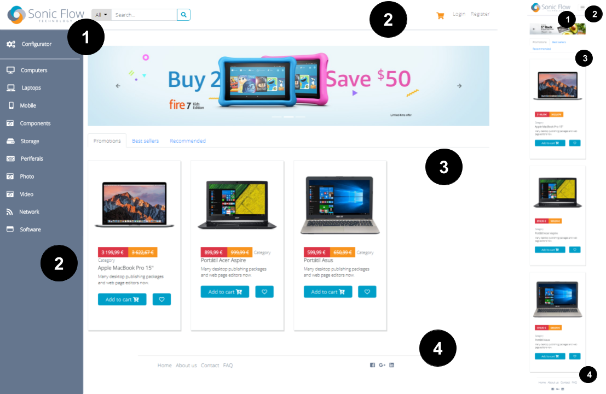
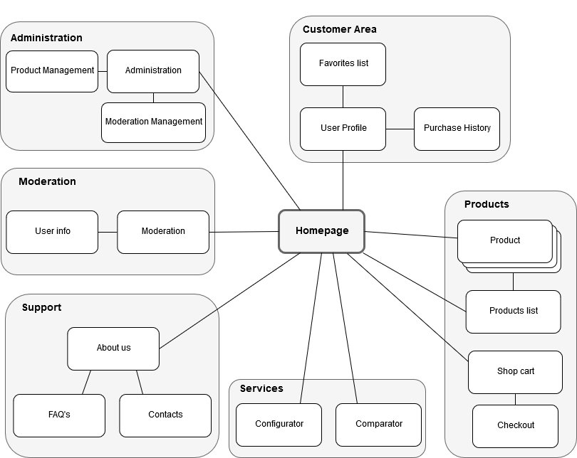
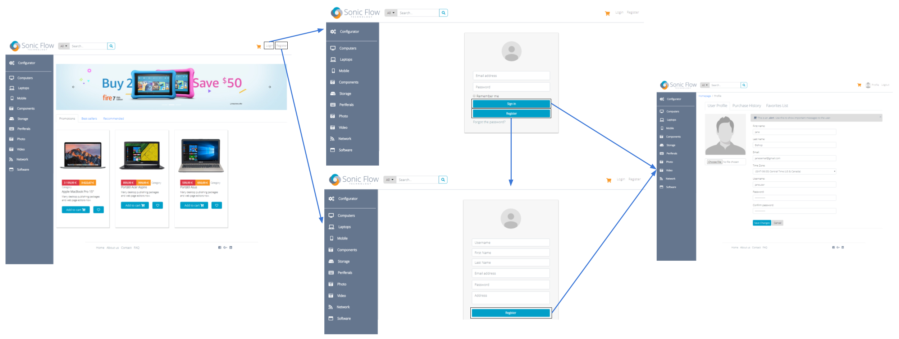
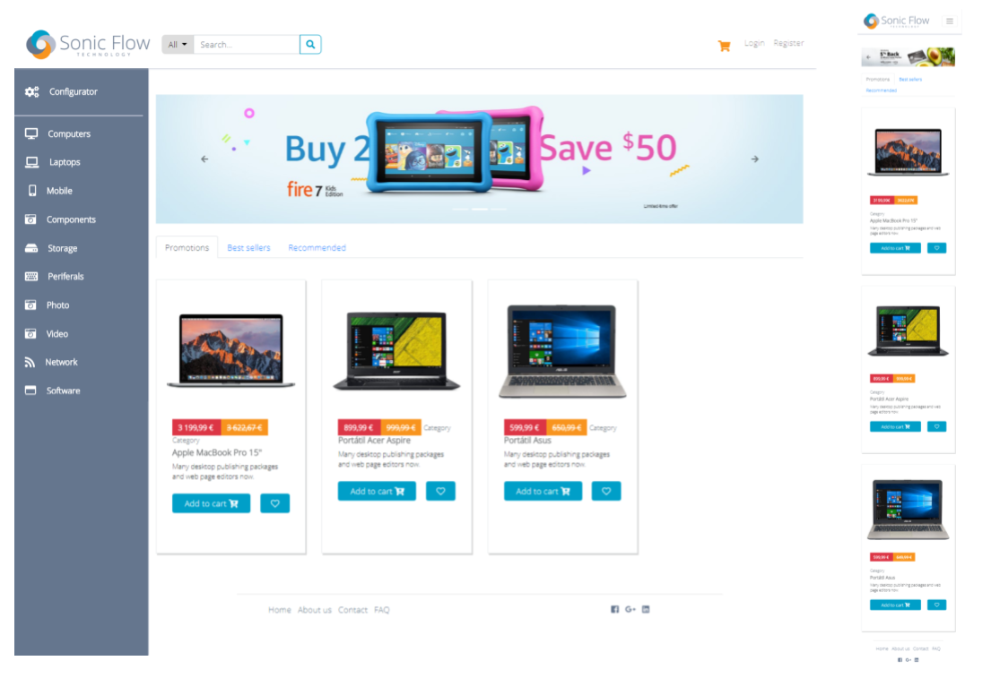
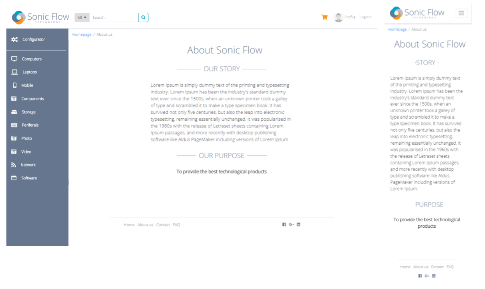
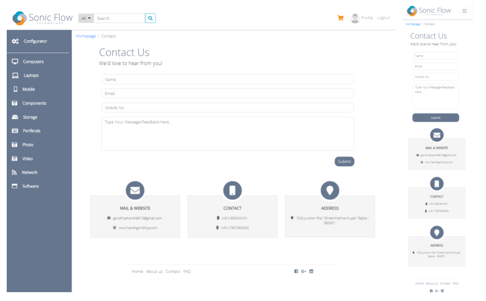
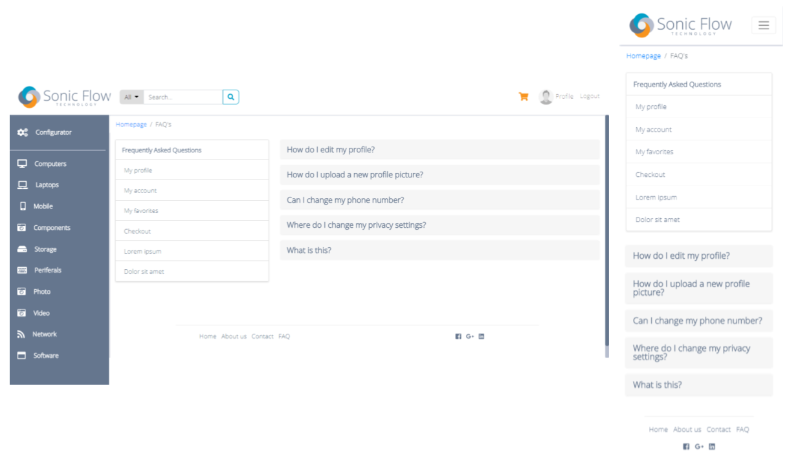
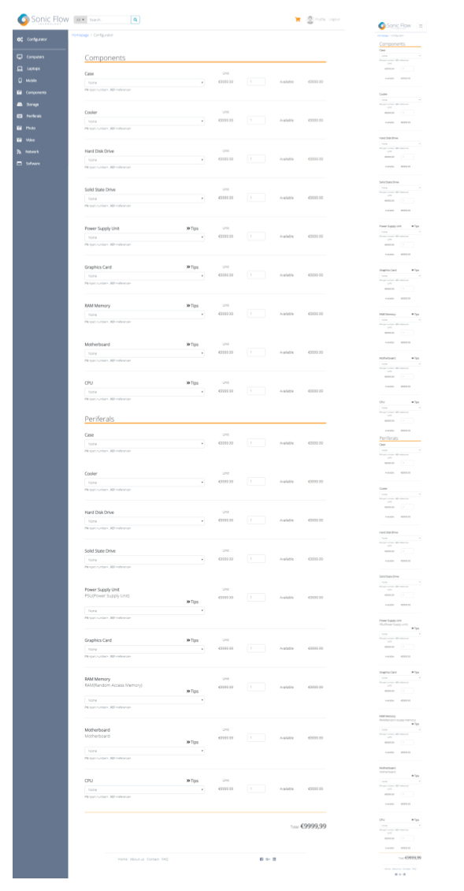

# A3: User Interface Prototype

## 1. Interface and common features
*Sonic Flow* is a web application based on HTML5, JavaScript and CSS. The user interface was implemented using the Bootstrap 4 framework.

1. **Logo**
2. **Navigation**
3. **Content**
4. **Footer**

Figure 1: Interface's guidelines.

In this figure some characteristics common to all the pages are highlighted:
* We opted for a simple design to have a flowing web page layout that suits various screen sizes, from desktops to smartphones.
* It was decided to stay within web conventions and use a color palette that fits our logo.
* The common links to the various pages maintain their position to make the user experience consistent.
* Different sections have clearly distinct styles in order to highlight distinct hierarchies of information, and assist with the visual flow.

## 2. Sitemap

## 3. Storyboards

Storyboards for the main use cases of the system.

Figure 1: Wireflow for the sign-in and sign-up interaction.

## 4. Interfaces

The following interfaces describe the main content of the web pages and their relative priority. These should be used for previewing the features and behaviour of the final product's different screens, both their desktop (left) and mobile (right) versions.

### UI01: Home

Figure 1: [Home page](https://xfontes42.github.io/lbaw1723/delivery/homepage_visitor.html)

### UI02: About

Figure 2: [About page](https://xfontes42.github.io/lbaw1723/delivery/aboutpage.html)

### UI03: Contact

Figure 3: [Contact page](https://xfontes42.github.io/lbaw1723/delivery/contacts.html)

### UI04: FAQ

Figure 4: [FAQ page](https://xfontes42.github.io/lbaw1723/delivery/faqpage.html)

### UI05: Configurator

Figure 5: [Configurator](https://xfontes42.github.io/lbaw1723/delivery/configurator.html)

### UI06: Product Listing

Figure 6: [Product Listing](https://xfontes42.github.io/lbaw1723/delivery/productsListpage.html)

### UI07: Product Comparator

Figure 7: [Product Comparator](https://xfontes42.github.io/lbaw1723/delivery/comparator.html)

### UI08: Product Page

Figure 8: [Product Page](https://xfontes42.github.io/lbaw1723/delivery/product.html)

### UI09: Shopping Cart

Figure 9: [Shopping Cart](https://xfontes42.github.io/lbaw1723/delivery/shoppingCart.html)

### UI10: Order Checkout

Figure 10: [Order Checkout](https://xfontes42.github.io/lbaw1723/delivery/checkoutpage.html)

### UI11: Profile

Figure 11: [Profile](https://xfontes42.github.io/lbaw1723/delivery/profilepage.html)

### UI12: Purchase History

Figure 12: [Purchase History](https://xfontes42.github.io/lbaw1723/delivery/profilepage.html)

### UI12: Favorites
* List of favorite products

Figure 13: [Favorites](https://xfontes42.github.io/lbaw1723/delivery/profilepage.html)

### UI13: Product Edit/Add
* Fields of product become editable

Figure 14: [Product Edit/Add](https://xfontes42.github.io/lbaw1723/delivery/product_editable.html)

### UI14: Moderator Profile

Figure 15: [Moderator Profile](https://xfontes42.github.io/lbaw1723/delivery/moderator.html)

## Revision history

Changes made to the first submission:
1. Item 1
1. Item 2

***

 
GROUP1723, 16/02/2018
 
 

> Ana Cláudia Fonseca Santos, up200700742@fe.up.pt

> Eduardo de Mendonça Rodrigues Salgado Ramos, up201505779@fe.up.pt

> Mariana Lopes da Silva, up201506197@fe.up.pt

> Xavier Reis Fontes, up201503145@fe.up.pt
