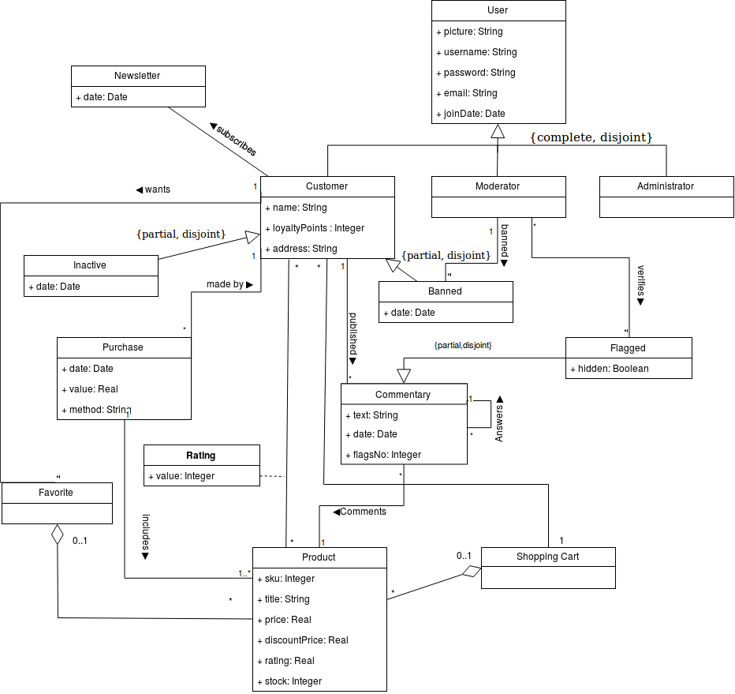

# A4: Conceptual Data Model
 
## 1. Class diagram

> UML class diagram containing the classes, associations, multiplicity and roles.
> For each class, the attributes, associations and constraints are included in the class diagram
 
## 2. Additional Business Rules

Estas business rules são para tudo o que não está expresso no diagrama. Ver modelo e ir tirando as que já são "representadas". São as do A2

### 2.2. Visitor
|Identifier	|Name	|Priority	|Description|
|:---------:|-----|:-------:|-----------|
|US11|Log in	|high|	As a Visitor, I want to authenticate into the system, so that I can access privileged information.|
|US12|Register |high|	As a Visitor, I want to register myself into the system, so that I can authenticate myself into the system.|
|US13|Register using external API|low|	As a Visitor, I want to use register a new account linked to my Google/Facebook account, so that I can access privileged information.|
|US14|Log in using external API|low|	As a Visitor, I want to log in through my Google/Facebook account, so that I can authenticate myself into the system.|

Table 3: Visitor's user stories.

### 2.3. Customer
|Identifier	|Name	|Priority	|Description|
|:---------:|-----|:-------:|-----------|
|US21|Product in Cart|high|	As a Customer, I want to put a product in my cart, so that I can go through with the buy.|
|US22|Checkout|high|	As a Customer, I want to got through with the checkout, so that I can pay for the items in my cart.|
|US23|Pay Products|high| As a Customer, I want to pay for the items in my cart, so that I can complete the order.|
|US23|Favorites add|high|	As a Customer, I want to add an item to my favorites.|
|US24|Comment|high|	As a Customer, I want to register a comment, so that I can manifest my opinion about a product.|
|US25|Rate|high|	As a Customer, I want to rate a product, so that I can classify it.|
|US26|Purchase History|medium|	As a Customer, I want to access my purchase history, so that I can see what I have previously bought.|
|US27|Newsletter|medium|	As a Customer, I want to enable or disable newsletter, so that I can recieve updates on new products and promotions.|
|US28|Availability|low| As a Custumer, I want to be able to be notified when a product is available, so that I know a product I want is currently in stock.|

Table 4: Customer's user stories.

### 2.4. Moderator
|Identifier	|Name	|Priority	|Description|
|:---------:|-----|:-------:|-----------|
|US31|Remove Comments|high|	As a Moderator, I want to remove a comment, so that I remove inappropriate content.|
|US32|Add Offense|medium|	As a Moderator, I want to record the number of offenses commited by a system user, so that moderators know how many times he has engaged in improper behavior.|
|US33|Ban User|medium|	As a Moderator, I want to be able to ban a user when he commited too many offenses, so that I can punish improper behavior.|

Table 5: Moderator's user stories.

### 2.5. Administrator
|Identifier	|Name	|Priority	|Description|
|:---------:|-----|:-------:|-----------|
|US41|Add Product|high|As an Administrator, I want to add a product, so that I can provide new items to the system.|
|US42|Remove Product|high|As an Administrator, I want to remove a product, so that I can take an item off from the system.|
|US43|Modify Product|high|As an Administrator, I want to change a product's attributes, so that I can update the information of a given product.|

### 2.6.Owner
|Identifier	|Name	|Priority	|Description|
|:---------:|-----|:-------:|-----------|
|US51|Edit Profile|high|I want to change my information, so that I can keep it updated (e.g. password,address,profile picture).|
|US52|Remove Comment|high|As an Owner, I want to remove a comment I made on a product, so that I can correct mistakes or rewrite history.|
|US53|Favorites remove|high|	As an Owner, I want to remove an item from my favorites.|
|US54|Account Delete|high|	As an Owner, I want to be able to delete my account.|

### 2.7 BRs
|Identifier	|Name	|Description|
|:---------:|-----|-----------|
|BR01|Consistency|A customer can only comment on a product he has previously bought.|
|BR02|Stock Management|A product can only be bought if it is available.|
|BR04|Loyalty Discounts|1000 LP can be used as a 10% discount on a single purchase. This purchase will not add LP.|
|BR05|Comment History|When a comment is deleted it should be replaced with a generic [DELETED] comment. This prevents confusion in comments' history.||Identifier	|Name	|Description|
|:---------:|-----|-----------|
|BR01|Consistency|A customer can only comment on a product he has previously bought.|
|BR02|Stock Management|A product can only be bought if it is available.|
|BR03|Configurator|The configurator only uses products that are desktop computer parts.|

 * adicionar regra sobre customer so por comentario num produto que comprou

> Business rules can be included in the UML diagram as UML notes or in a table in this section.
 
## Revision history
 
Changes made to the first submission:
1. Item 1
1. Item 2
 
***
 
 
GROUP1723, 13/03/2018
 
 

> Ana Cláudia Fonseca Santos, up200700742@fe.up.pt

> Eduardo de Mendonça Rodrigues Salgado Ramos, up201505779@fe.up.pt

> Mariana Lopes da Silva, up201506197@fe.up.pt

> Xavier Reis Fontes, up201503145@fe.up.pt